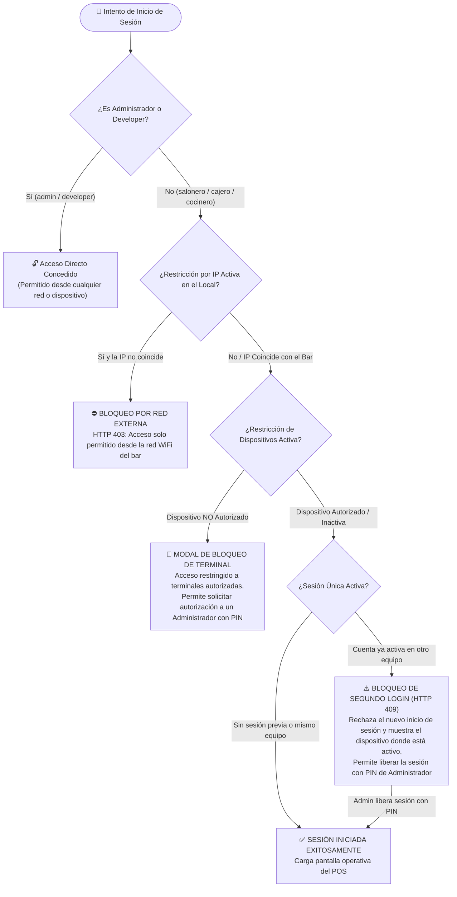

# 🛡️ Cronograma y Arquitectura de Seguridad - GastroBar POS

Este documento describe el flujo completo de validación de accesos, protección contra accesos remotos no autorizados, control de dispositivos autorizados y prevención de clonación de cuentas en el sistema GastroBar POS.

---

## 📊 Diagrama de Flujo de Acceso y Validación de Seguridad

---

## 🛡️ Las 3 Capas de Protección Explicadas

### 1️⃣ Capa 1: Restricción de Red por IP Pública del Bar
* **Objetivo:** Impedir que los empleados ingresen al sistema desde sus casas, datos móviles fuera del local o conexiones remotas.
* **Mecanismo:** El servidor compara la IP pública de la petición HTTP contra la IP configurada en la base de datos para el negocio.
* **Roles Exentos:** `admin`, `superadmin`, `developer` pueden entrar desde cualquier ubicación para tareas de gestión o soporte.

### 2️⃣ Capa 2: Lista Blanca de Dispositivos Autorizados (Device Whitelisting)
* **Objetivo:** Evitar que un empleado le dé sus credenciales a un cliente conectado al WiFi del bar o use un teléfono personal no registrado.
* **Mecanismo:**
  * Cada terminal autorizada posee un token criptográfico único (`pos_device_token`) guardado en almacenamiento local seguro.
  * Al iniciar sesión con un rol operativo, el servidor verifica que el token esté registrado en la tabla `DispositivosAutorizados` y en estado `activo = 1`.
  * Si el equipo no está registrado, el sistema bloquea el acceso con código HTTP 403 y muestra una ventana emergente de terminal no autorizada.
* **Autorización Rápida:** Un administrador puede ingresar su PIN o credenciales en esa misma ventana emergente para registrar y nombrar la nueva terminal (ej. *"Tablet Terraza 1"*, *"PC Caja Principal"*).

### 3️⃣ Capa 3: Sesión Única Activa (Bloqueo de 2do Login Concurrente)
* **Objetivo:** Impedir que una misma cuenta de empleado sea utilizada en dos dispositivos simultáneamente, protegiendo la integridad de comandas y cobros.
* **Mecanismo de Bloqueo Estricto:**
  * Si el usuario ya cuenta con una sesión activa en el Dispositivo A e intenta iniciar sesión en el Dispositivo B, **el servidor rechaza el nuevo login con HTTP 409 Conflict**.
  * En pantalla se despliega el modal informativo indicando en qué terminal se encuentra abierta la cuenta.
* **Mecanismo de Liberación / Desbloqueo:**
  1. **Cierre Natural:** El empleado cierra sesión en el Dispositivo A (`POST /api/auth/logout`), liberando la cuenta inmediatamente.
  2. **Liberación Administrativa con PIN:** Si el equipo previo se apagó, descargó o extravió, un Administrador puede pulsar *"Desconectar Sesión Previa"* e ingresar su PIN para liberar la cuenta (`POST /api/admin/usuarios/:id/liberar-sesion`).
  3. **Reingreso en Mismo Dispositivo:** Si el empleado refresca la página o reingresa su PIN en el *mismo equipo registrado*, el acceso se concede automáticamente sin bloqueo.

---

## 📋 Matriz de Roles y Niveles de Restricción

| Rol | Restricción por IP | Restricción de Dispositivo | Sesión Única | Puede Autorizar / Desbloquear |
| :--- | :---: | :---: | :---: | :---: |
| **Developer / Soporte** | ❌ Exento | ❌ Exento | ❌ Exento | ✅ Sí |
| **Super Administrador / Admin** | ❌ Exento | ❌ Exento | ❌ Exento | ✅ Sí |
| **Cajero** | ✅ Aplica | ✅ Aplica | ✅ Aplica (Bloqueo Concurrente) | ❌ No |
| **Salonero / Mesero / Bartender** | ✅ Aplica | ✅ Aplica | ✅ Aplica (Bloqueo Concurrente) | ❌ No |
| **Cocinero / Cocina** | ✅ Aplica | ✅ Aplica | ✅ Aplica (Bloqueo Concurrente) | ❌ No |

---

## ⚙️ Guía de Uso Rápida para el Administrador

1. **Acceder a la Configuración:**
   * Entra al sistema como Administrador.
   * Ve a **⚙️ Menú Administración** ➔ **🌐 Seguridad & Red del Local**.
2. **Activar las Protecciones:**
   * Activa el interruptor **"Restringir a Dispositivos Autorizados"**.
   * Activa el interruptor **"Sesión Única Activa"**.
   * *(Opcional)* Si el bar tiene IP fija, ingresa la IP en **"Restricción por IP Pública"**.
3. **Gestionar Terminales:**
   * En la tabla inferior puedes ver el nombre, tipo de equipo, navegador y fecha de cada dispositivo registrado.
   * Puedes revocar el acceso de cualquier dispositivo en cualquier momento haciendo clic en el botón de eliminar 🗑️.
4. **Liberación de Sesiones:**
   * Si un mesero o cajero no puede ingresar porque su sesión quedó abierta en una tablet sin batería, el administrador ingresa su PIN en el modal de alerta y la sesión queda liberada al instante.