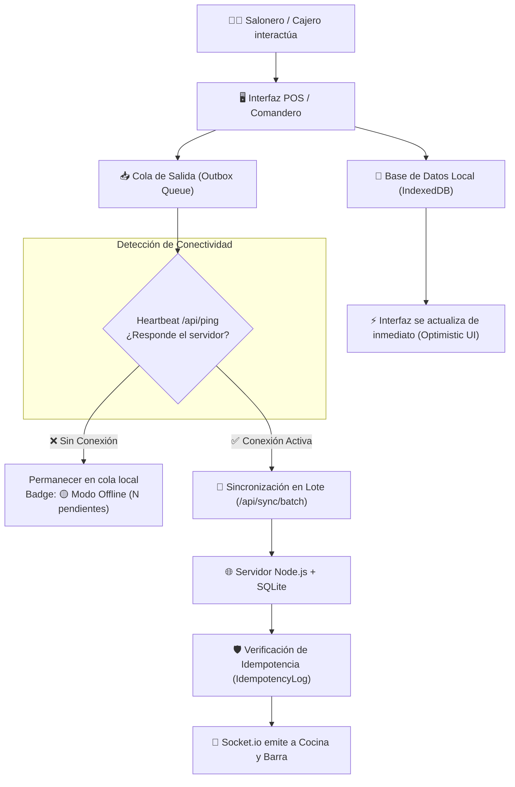

# Plan de Implementación: Arquitectura Offline-First (Resistencia a Caídas de Red)

**Estado:** ✅ Implementado y Verificado  
**Commit:** `2475eac`  
**Fecha:** Septiembre 2026  

---

## 🎯 Objetivo
Permitir que el sistema GastroBar POS opere sin interrupciones ante cortes de internet WAN o pérdidas de conectividad Wi-Fi, guardando pedidos y comandas localmente en el dispositivo y sincronizándolos automáticamente en lote al restablecerse la conexión, garantizando que nunca se dupliquen comandas ni cobros.

---

## 🏗️ Arquitectura Técnica

---

## 📁 Archivos Creados y Modificados

### 1. `public/manifest.json` (PWA Standalone)
Configuración de Progressive Web App para instalación como app nativa en tablets y celulares (pantalla completa, tema `#0284c7`, fondo `#0b1120`).

### 2. `public/sw.js` (Service Worker)
- Estrategia **Cache-First** para recursos estáticos (`.html`, `.css`, `.js`, imágenes, fuentes).
- Estrategia **Network-First con fallback a cache** para llamadas API `GET` y navegación.

### 3. `public/offline-db.js` (Motor IndexedDB `gastrobar_pos_offline`)
- Almacenes de objetos:
  - `catalogo`: Almacena la copia local de productos, precios y categorías.
  - `mesas`: Almacena el estado y distribución de las mesas.
  - `outbox`: Cola de operaciones acumuladas sin conexión con `idempotencyKey` única.
  - `meta`: Marcas de tiempo de última sincronización.

### 4. `public/offline-sync.js` (Gestor de Red & Sincronizador)
- Detección reactiva de eventos `online`/`offline`.
- Heartbeat activo cada 15 segundos a `/api/ping`.
- Interceptor optimista `PosOfflineSync.ejecutarConRespaldo()`: si no hay red, guarda en `outbox` y avanza la pantalla sin bloquear al personal.
- Sincronizador automático que vacía el `outbox` hacia `/api/sync/batch` al reconectar.

### 5. `server.js` (Backend con Idempotencia)
- Tabla SQLite `IdempotencyLog (idempotency_key, accion, creado_en)`.
- Endpoint `GET /api/ping`: Healthcheck liviano.
- Endpoint `POST /api/sync/batch`: Procesa lotes de comandas y solicitudes offline, filtrando duplicados.
- Soporte de `idempotencyKey` en `POST /api/comandas/enviar`.

### 6. `public/index.html` & `public/styles.css`
- Badge `#netStatusBadge` en la barra superior (🟢 En línea, 🟡 Offline, 🔄 Sincronizando).
- Modal interactivo `#modalEstadoRed` para diagnóstico y sincronización forzada.

---

## 🧪 Pruebas Automatizadas
Suite dedicada en `test/e2e/tier6-offline-sync.test.js`:
- `T6.1`: `GET /api/ping` responde 200 con timestamp.
- `T6.2`: `POST /api/comandas/enviar` respeta `idempotencyKey` y previene duplicaciones en reintentos.
- `T6.3`: `POST /api/sync/batch` procesa acciones acumuladas y descarta duplicadas.
- `T6.4`: `POST /api/sync/batch` procesa solicitudes de cuenta `PEDIR_CUENTA`.

