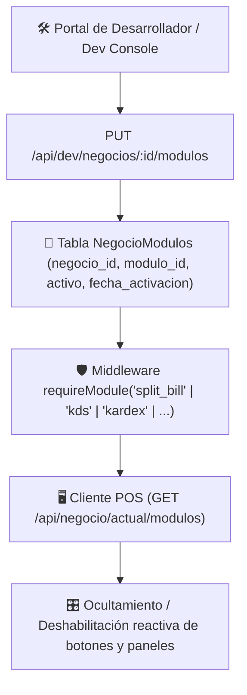

# Plan de Implementación: Arquitectura Modular SaaS y Centro de Licenciamiento

**Estado:** ✅ Implementado y Verificado  
**Fecha:** Septiembre 2026  
**Tier de Pruebas:** Tier 7 (`test/e2e/tier7-modular-saas.test.js`)

---

## 🎯 Objetivo
Permitir la activación/desactivación granular de los 11 módulos comerciales del sistema GastroBar POS por negocio/sucursal, habilitando planes (Básico, Estándar, Premium, Enterprise) y restringiendo dinámicamente rutas API y elementos de la interfaz de usuario según la suscripción activa.

---

## 🏗️ Arquitectura Técnica

---

## 📦 Catálogo de Módulos Soportados (11 Módulos)
1. `kds_cocina`: Pantalla de cocina y barra KDS en tiempo real.
2. `kardex_inventario`: Control de insumos, recetas y escandallos.
3. `split_bill`: División de cuentas por persona o ítems.
4. `happy_hour`: Precios especiales, promociones 2x1 y horarios.
5. `mesas_multi_piso`: Gestión gráfica de salón y múltiples niveles.
6. `qr_mesas`: Menú digital y llamado a mesero vía código QR.
7. `caja_arqueos`: Apertura, cortes X/Z y arqueo de caja.
8. `facturacion_electronica`: Emisión de comprobantes fiscales y tiquetes.
9. `propinas_pool`: Reparto de propinas y comisiones a saloneros.
10. `reportes_avanzados`: Dashboard analítico de ventas y métricas.
11. `offline_pwa`: Soporte sin internet y sincronización en segundo plano.

---

## 🧪 Pruebas Automatizadas (Tier 7)
- `T7.1`: `GET /api/dev/modulos/catalogo` retorna los 11 módulos del catálogo oficial.
- `T7.2`: `GET /api/dev/negocios/:id/modulos` retorna los módulos activos por defecto.
- `T7.3`: `PUT /api/dev/negocios/:id/modulos` actualiza módulos asignados y presets de planes.
- `T7.4`: `GET /api/negocio/actual/modulos` entrega los módulos activos para el cliente POS.
- `T7.5`: Desactivar `split_bill` restringe acceso al módulo y lo excluye de la lista activa.
