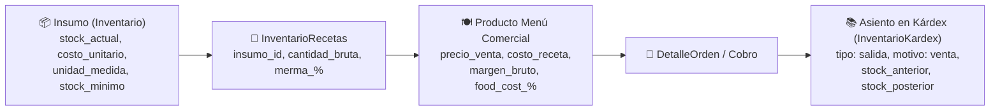

# Plan de Implementación: Inventario Inteligente por Recetas, Escandallos y Kárdex 2026

**Estado:** ✅ Implementado y Verificado  
**Fecha:** Septiembre 2026  
**Tier de Pruebas:** Tier 8 (`test/e2e/tier8-inventario-recetas.test.js`)

---

## 🎯 Objetivo
Transformar el control de existencias en un sistema profesional de gastronomía y coctelería basado en escandallos técnicos, deducciones automáticas en tiempo real al facturar/comandar, costeo exacto con margen de ganancia y food cost %, cálculo de porciones disponibles según stock crítico y sugerencias inteligentes de compras.

---

## 🏗️ Estructura de Base de Datos y Fórmulas

### Fórmulas Contables Implementadas:
- **Costo de Ingrediente con Merma:**
  $$\text{Costo Ingrediente} = \text{Cantidad Bruta} \times \left(1 + \frac{\text{Merma \%}}{100}\right) \times \text{Costo Unitario Insumo}$$
- **Food Cost %:**
  $$\text{Food Cost \%} = \left(\frac{\text{Costo Total Receta}}{\text{Precio Venta}}\right) \times 100$$
- **Margen Bruto %:**
  $$\text{Margen Bruto \%} = 100\% - \text{Food Cost \%}$$
- **Rendimiento Máximo de Porciones:**
  $$\text{Porciones Disponibles} = \min_{i \in \text{Ingredientes}} \left\lfloor \frac{\text{Stock Actual}_i}{\text{Cantidad Requerida}_i \times (1 + \text{Merma}_i)} \right\rfloor$$

---

## 🧪 Pruebas Automatizadas (Tier 8)
- `T8.1`: `GET /api/admin/recetas/:productoId` devuelve desglose de costo, márgenes y porciones disponibles.
- `T8.2`: `POST` y `DELETE` en `/api/admin/recetas/:productoId/ingredientes` gestionan insumos dinámicamente con mermas.
- `T8.3`: `descontarInventarioPorItems` descuenta proporcionalmente materias primas y genera movimientos en Kárdex.
- `T8.4`: Ajustes manuales de inventario registran asientos contables con impacto financiero.
- `T8.5`: `GET /api/admin/inventario/sugerencia-compras` calcula sugerencias de reabastecimiento y presupuesto estimado.
