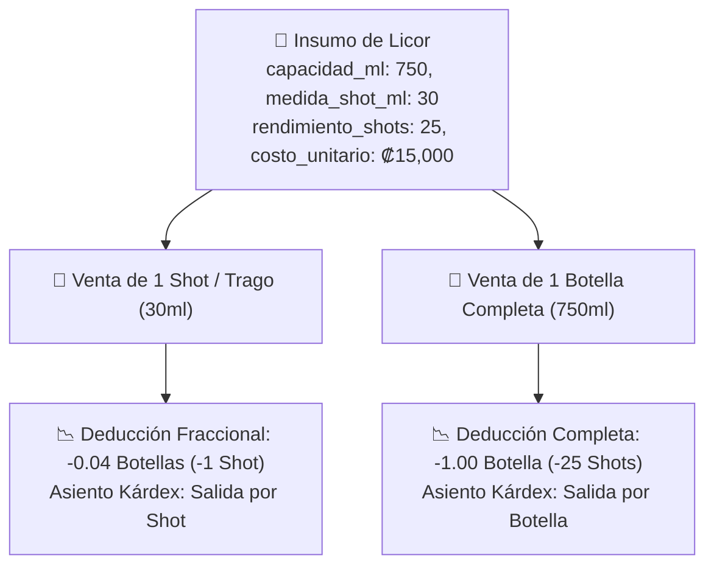

# Plan de Implementación: Control de Licores, Botellas y Medidas de Shots Configurables 2026

**Estado:** ✅ Implementado y Verificado  
**Fecha:** Septiembre 2026  
**Tier de Pruebas:** Tier 9 (`test/e2e/tier9-licores-shots.test.js`)

---

## 🎯 Objetivo
Permitir el control dual de botellas cerradas y tragos/shots servidos en barra, admitiendo capacidades volumétricas configurables (750ml, 1000ml, 1500ml Magnum, 1750ml) y medidas de onzas/shots personalizadas (1 oz / 30ml, 1.25 oz / 37.5ml, 1.5 oz / 45ml, 2 oz / 60ml) con cálculo de rendimiento y costeo exacto por trago.

---

## 🏗️ Lógica de Deducción Dual y Fórmulas

### Fórmulas Implementadas:
- **Rendimiento Teórico:**
  $$\text{Rendimiento (Shots)} = \left\lfloor \frac{\text{Capacidad (ml)}}{\text{Medida por Shot (ml)}} \right\rfloor$$
- **Costo Unitario por Shot:**
  $$\text{Costo por Shot} = \frac{\text{Costo Botella}}{\text{Rendimiento (Shots)}}$$
- **Deducción Fraccional en Kárdex:**
  $$\Delta \text{Stock Botellas} = \frac{\text{Shots Vendidos}}{\text{Rendimiento}}$$

---

## 🧪 Pruebas Automatizadas (Tier 9)
- `T9.1`: Licores iniciales poseen flags `es_licor=1`, capacidad, medida y rendimiento dual.
- `T9.2`: Registro de botella de 1L con shot de 1.5 oz (45ml) calcula rendimiento (22 shots) y costo unitario.
- `T9.3`: Edición de capacidad a Magnum (1500ml) recalcula rendimiento a 50 shots de 30ml.
- `T9.4`: Venta de trago descuenta fraccionalmente la botella en Kárdex.
- `T9.5`: Venta de botella completa descuenta 1 botella entera y 25 shots en auditoría.
- `T9.6`: `GET /api/admin/inventario/:id/kardex` entrega detalle volumétrico de licores.
- `T9.7`: Creación de categoría al vuelo con vinculación inmediata a Kárdex.
- `T9.8` - `T9.11`: Operaciones `PUT` y `DELETE` con seguridad de roles (403 para cajero/salonero), actualización atómica y borrado suave.
