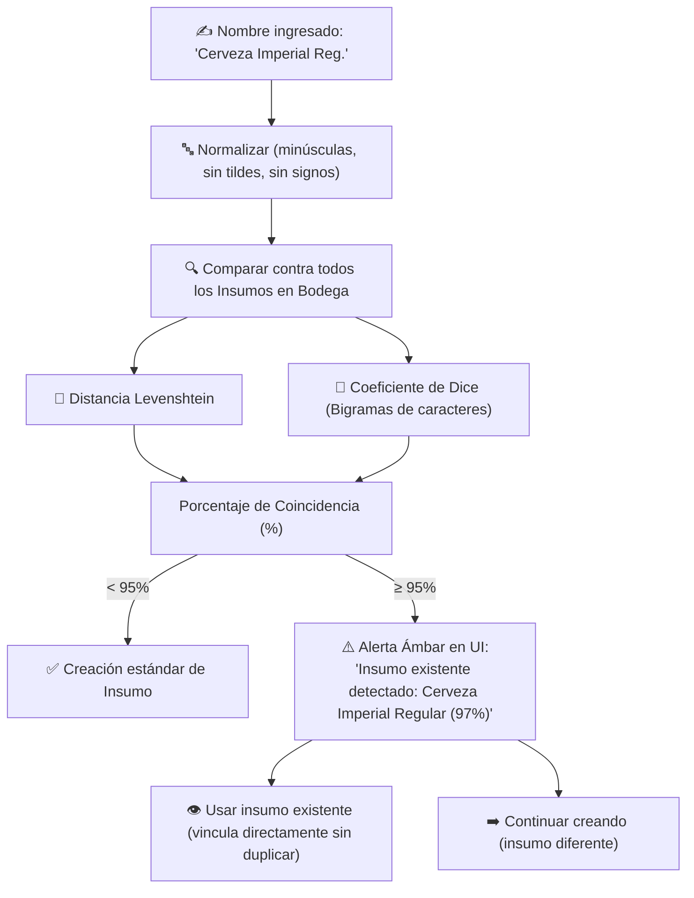

# Plan de Implementación: Auto-Conversión a Insumo en Kárdex, Homologación de Categorías y Similitud ≥ 95%

**Estado:** ✅ Implementado y Verificado  
**Fecha:** Septiembre 2026  
**Tier de Pruebas:** Tier 10 (`test/e2e/tier10-insumo-conversion-similitud.test.js`)

---

## 🎯 Objetivo
Agilizar el flujo de creación de productos comerciales en el catálogo permitiendo que se creen simultáneamente como insumos de bodega con deducción 1 a 1 en Kárdex, homologando selectores de categoría oficiales y previniendo duplicados accidentales con un algoritmo de similitud difusa al 95%.

---

## 🏗️ Algoritmo de Similitud Difusa (Levenshtein + Dice Bigrams)

---

## 🧪 Pruebas Automatizadas (Tier 10)
- `T10.1`: Validación del algoritmo de similitud ante variaciones ortográficas y transposición.
- `T10.2`: Creación de insumo y enlace 1 a 1 de producto comercial a Kárdex.
- `T10.3`: Deducción de stock en inventario y generación de asiento contable de salida al realizar cobro directo.
