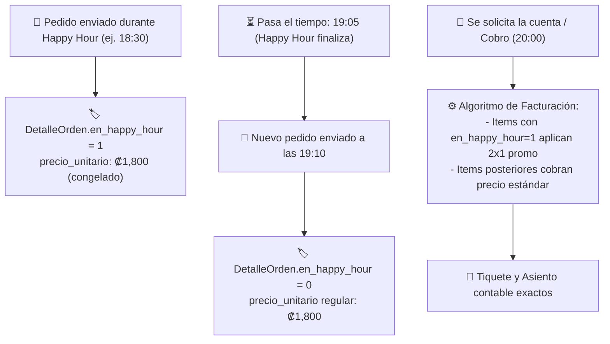

# Plan de Implementación: Persistencia y Permanencia de Descuentos Happy Hour tras Expiración

**Estado:** ✅ Implementado y Verificado  
**Fecha:** Septiembre 2026  
**Tier de Pruebas:** Tier 11 (`test/e2e/tier11-happy-hour-permanence.test.js`)

---

## 🎯 Objetivo
Garantizar la regla contable y legal de hospitalidad: cualquier bebida o producto ordenado mientras la promoción Happy Hour (2x1 o precio especial) estaba activa debe mantener su precio promocional intacto al momento del cobro final o emisión de factura, incluso si la mesa permanece abierta y la hora programada del Happy Hour ya venció.

---

## 🏗️ Mecanismo de Congelación de Precios

---

## 🧪 Pruebas Automatizadas (Tier 11)
- `T11.1`: Las bebidas agregadas durante Happy Hour conservan el flag `en_happy_hour=1`.
- `T11.2`: La expiración del horario no altera el estado de los ítems existentes en mesas activas.
- `T11.3`: Los nuevos ítems ordenados post-expiración no reciben el beneficio promocional.
- `T11.4`: La finalización del pago preserva el descuento en el tiquete y los cierres de caja.
