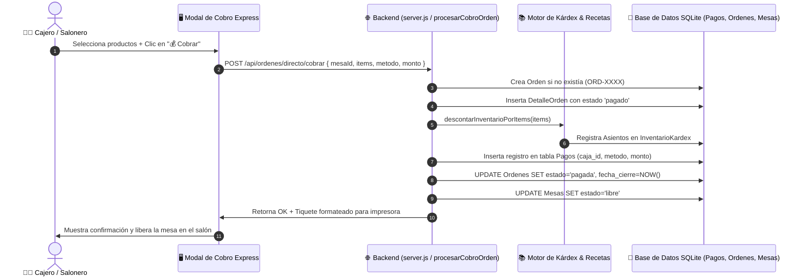

# Plan de Implementación: Cobro Directo de Comanda con Descuento Inmediato en Kárdex y Liberación de Mesa

**Estado:** ✅ Implementado y Verificado  
**Fecha:** Septiembre 2026  
**Commit:** `aa82c7b`  

---

## 🎯 Objetivo
Permitir el flujo express de cobranza en barra y cajas rápidas donde el cajero o salonero ingresa los ítems en pantalla y presiona directamente **`💰 Cobrar`** sin necesidad de presionar previamente *Guardar Comanda*, asegurando que los ítems se registren en la base de datos, se descuente el inventario/recetas de Kárdex, se emita el tiquete y la mesa quede liberada de forma atómica.

---

## 🏗️ Flujo de Cobro Directo Atómico

---

## 🧪 Validación y Pruebas
- Verificado en flujo express de mostrador y barra.
- Verificado descuento proporcional de shots y botellas completas.
- Verificado el cierre automático de órdenes huérfanas y liberación de mesas.
