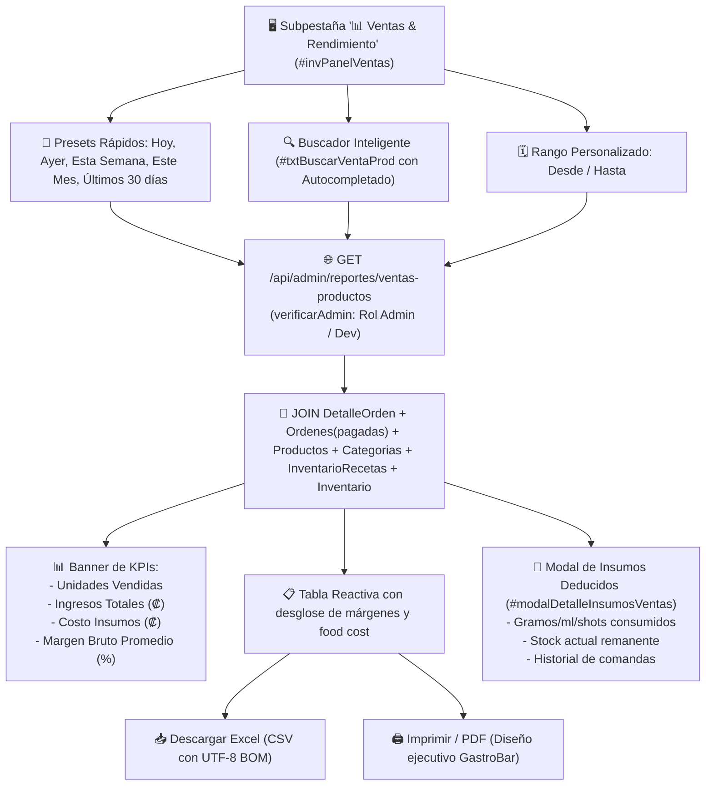

# Plan de Implementación: Reporte de Ventas por Producto, Período y Consumo de Insumos en Kárdex 2026

**Estado:** ✅ Implementado y Verificado  
**Fecha:** Septiembre 2026  
**Commit:** `203f22e`  
**Tier de Pruebas:** Tier 15 (`test/e2e/tier15-ventas-productos-periodo.test.js`)

---

## 🎯 Objetivo
Proporcionar a los administradores y gerentes un panel analítico dentro de la sección **Control de Inventario y Escandallos 2026** (ubicado inmediatamente a la derecha del botón `🛒 Sugerencia de Compras` bajo la subpestaña **`📊 Ventas & Rendimiento`**) para consultar las ventas históricas de cualquier producto en un rango de fechas, con buscador predictivo inteligente, cálculo de rentabilidad, desglose de ingredientes de escandallo deducidos de bodega y exportación a Excel (CSV con UTF-8 BOM) y PDF.

---

## 🏗️ Arquitectura Técnica

---

## 🧪 Pruebas Automatizadas (Tier 15)
- `T15.1`: Seguridad: Rechazo 403 a saloneros y cajeros, acceso permitido a admin y developer.
- `T15.2`: Contabiliza con precisión solo órdenes pagadas (omite abiertas o canceladas).
- `T15.3`: Filtrado estricto por fechas `desde` y `hasta`.
- `T15.4`: Desglose exacto de ingredientes de recetas deducidos de bodega y cálculo de margen de ganancia.
- `T15.5`: Filtro por categorías de productos.
