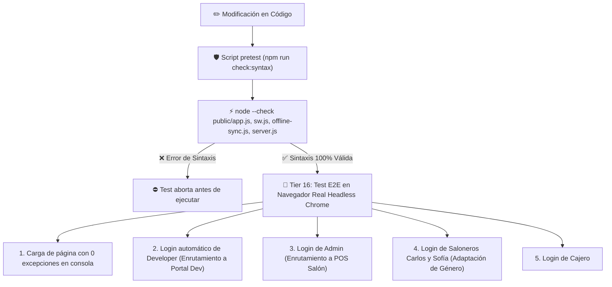

# Plan de Implementación: Blindaje Permanente de Sintaxis Frontend y Ciclo de Autenticación E2E

**Estado:** ✅ Implementado y Verificado  
**Fecha:** Septiembre 2026  
**Commit:** `HEAD`  
**Tier de Pruebas:** Tier 16 (`test/e2e/tier16-frontend-login-suite.test.js`)

---

## 🎯 Objetivo y Causa Raíz Solucionada
Eliminar de forma definitiva los fallos de inicio de sesión en `http://localhost:4000`. 

### Causa Raíz Detectada:
Al editar `public/app.js` sin verificación estática previa, se habían introducido declaraciones duplicadas (`const resInv`, `let kardex_tipo`, `let insumo_stock_actual`) y un encabezado de función no cerrado en `window.abrirModalAjusteRapido`. En JavaScript del navegador, un error de sintaxis en cualquier parte del archivo aborta inmediatamente la compilación de todo el script, dejando sin definir a `window.ejecutarLogin()` y `window.cargarCredencialDemo()`. Además, `public/index.html` contenía 3 etiquetas `<script src="app.js">` repetidas.

---

## 🏗️ Medidas de Blindaje Implementadas



---

## 📁 Correcciones Realizadas:
1. **`public/app.js`**: Eliminación de declaraciones duplicadas y cierre de bloques (`node --check` 100% limpio).
2. **`public/index.html`**: Unificación de la carga de scripts a una sola etiqueta con cache buster `app.js?v=2.9.7`.
3. **`public/sw.js`**: Actualización de la versión del Service Worker a `pos-static-v18` para forzar purga de scripts obsoletos en clientes.
4. **`package.json`**: Incorporación obligatoria del hook `"pretest": "npm run check:syntax"` antes de correr cualquier prueba.
5. **`test/e2e/tier16-frontend-login-suite.test.js`**: Nueva suite automatizada que levanta Headless Chrome y comprueba la autenticación real en el navegador.

---

## 🧪 Pruebas Automatizadas
```bash
npm test
```
**Resultado:** **122 pruebas aprobadas al 100% en 26 suites.**
